# Introduction

The project aims at developing a solution to measure the user's reflex time to a stimulus. To do so, we have designed various solutions, implemented and tested on an FPGA board. Furthermore, we also propose an alternative design that could be investigated to obtain yet other implementation. The overall goal is to have alternative designs, characterised by different relevant parameters (performance, size, ...) among which the user can choose. In the following, we first briefly introduce the three developed solutions, followed by the in-detail discussion of the implementations.

## First and Second Implementation

For the first two implementations, the user has to press a start button after resetting the module; once the start button has been pressed, a LED lights up after a random time between 1 and 5 seconds. The user has to press the start button again as soon as they see the LED light up.
The reaction time, in ms, is then displayed on the eight digit seven segment display. If the user pushes the button before the LED goes on, an error message is shown. If the user takes more than one second to react, a time-out message is shown. In any case, by pushing the start button once more a new test will start.

## Third Implementation

The third implementation has the goal of creating a more accurate measure by making the user repeat a series of (5) tests and computing the average measured value for the reflex time. After resetting the module, the start button is pushed by the user. This starts the first measurement; after each measurement the result is shown for 1 s, then the next test starts. Errors and time outs are not considered as valid tests and have to be repeated.

# Implementations

At the end of this section you are going to find a brief description of each component's behaviour and value in the module. The finite state machines below (the drawings of circles and arrows that show the expected behaviour based on inputs) describe how the reflex_test central process has been thought out. The implementations' main differences are related to how the reaction time is counted; it is important to note that, in order to show a number on the display, it is necessary to know each digit, and this is not an immediate thing when counting using binary-coded signals.

## First: binary counter

<figure id="fig:placeholder" data-latex-placement="H">
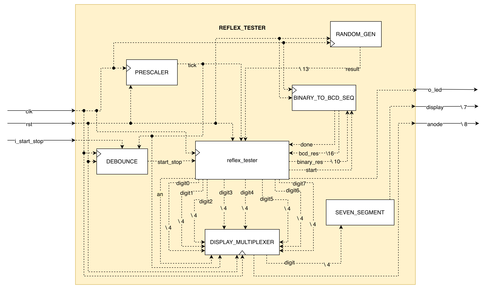
<figcaption>Schematic description of the components making up this module and the signals interconnecting them</figcaption>
</figure>

The first implementation follows the most intuitive approach: count the
reaction time the straightforward way (using a standard binary counter),
and then convert the result into the format needed by the display (BCD)
only when required. The binary counter increments by one every
millisecond, which is simple and efficient in terms of logic. However,
since the display expects the result in BCD format, a conversion step is
necessary before the result can be shown. This conversion is handled by
a dedicated module, binary_to_bcd_seq, which performs the Double Dabble
algorithm one step per clock cycle. As a result, the correct result
appears on the display up to 10 clock cycles(around 100 ns in this case)
after the stop button is pressed, which is completely imperceptible to a
human observer. This approach requires more LUTs and Flip-Flops than the
following implementation, due to the additional logic and registers
needed by the conversion module. An important design consideration is
that keeping the conversion in a separate module does not add complexity
to the overall design and makes the design more readable and easier to
extend or modify in the future. For the random delay generation, a
pretty simple approach is used: a free-running binary counter that is
sampled at the moment the user presses the start button. This reduces to
a register that is updated every clock cycle.

<figure id="fig:placeholder" data-latex-placement="H">
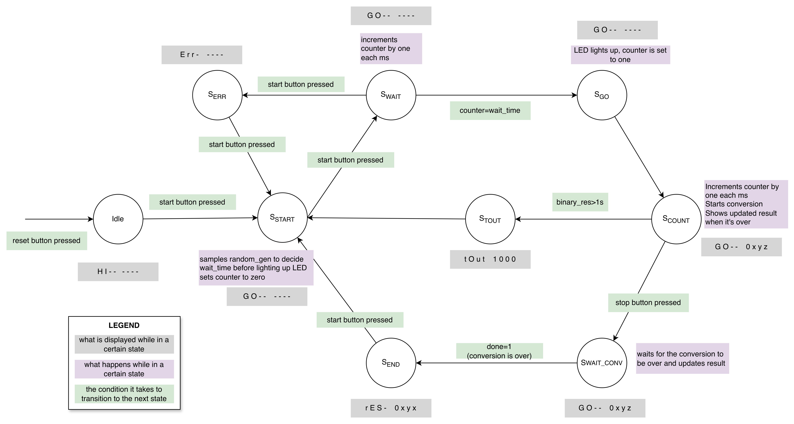
<figcaption>Finite state machine describing the module’s
behavior</figcaption>
</figure>

## Second: BCD counter and LFSR

<figure id="fig:placeholder" data-latex-placement="H">
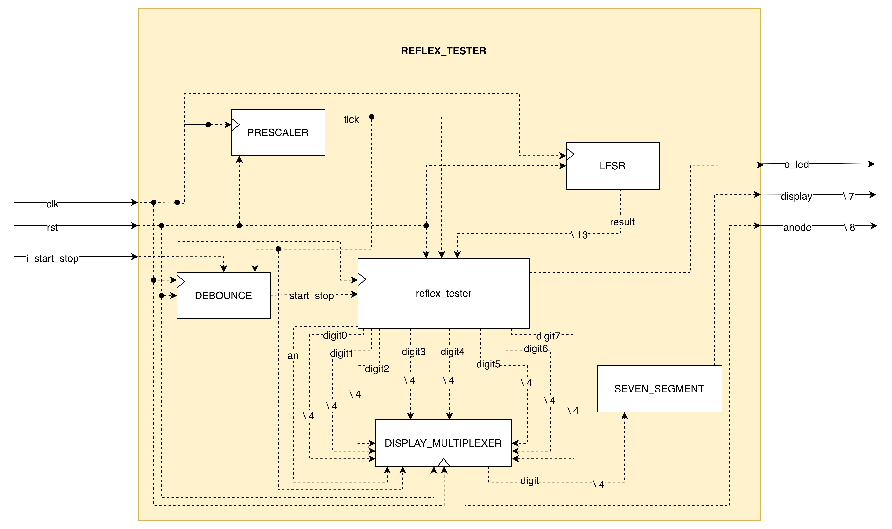
<figcaption>Schematic description of the components making up this
module and the signals interconnecting them</figcaption>
</figure>

The second implementation takes a different approach: the reaction time
is measured directly in BCD format using a cascade of four BCD counters,
one for each decimal digit . This mirrors the way a decimal counter
works in everyday life: each digit goes from 0 to 9, and when it
overflows it resets to 0 and increments the next digit. The key
advantage of this approach is that the result is always ready to be
displayed immediately, with no conversion step required. At every
millisecond tick, the counters are updated and the new value is directly
available to the display driver. In terms of logic resources, this
implementation uses fewer LUTs and FFs than the first one. This might
seem counterintuitive since counting like this requires extra logic, but
each BCD digit only needs to count from 0 to 9, which requires very
simple carry logic. On the contrary, the binary counter requires a
conversion stage that introduces additional combinatorial logic. For the
random delay generation, this implementation uses a Linear Feedback
Shift Register (LFSR). This produces a sequence of values that appears
random but is entirely deterministic and periodic. Compared to the
free-running counter used in the second implementation, an LFSR has
better statistical properties (it cycles through all possible values
before repeating) but both approaches occupy the same amount of logic on
the FPGA. Both of these implementations have their worst data path delay
in the prescaler module, since it requires to increment a 23 bit
counter.

<figure id="fig:placeholder" data-latex-placement="H">
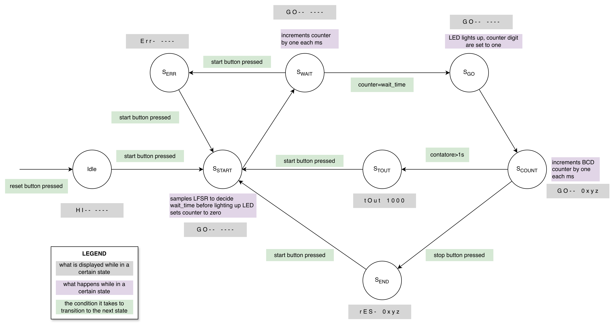
<figcaption>Finite state machine describing the module’s
behavior</figcaption>
</figure>

## Third: binary counter and LFSR for multiple tests

<figure id="fig:placeholder" data-latex-placement="H">
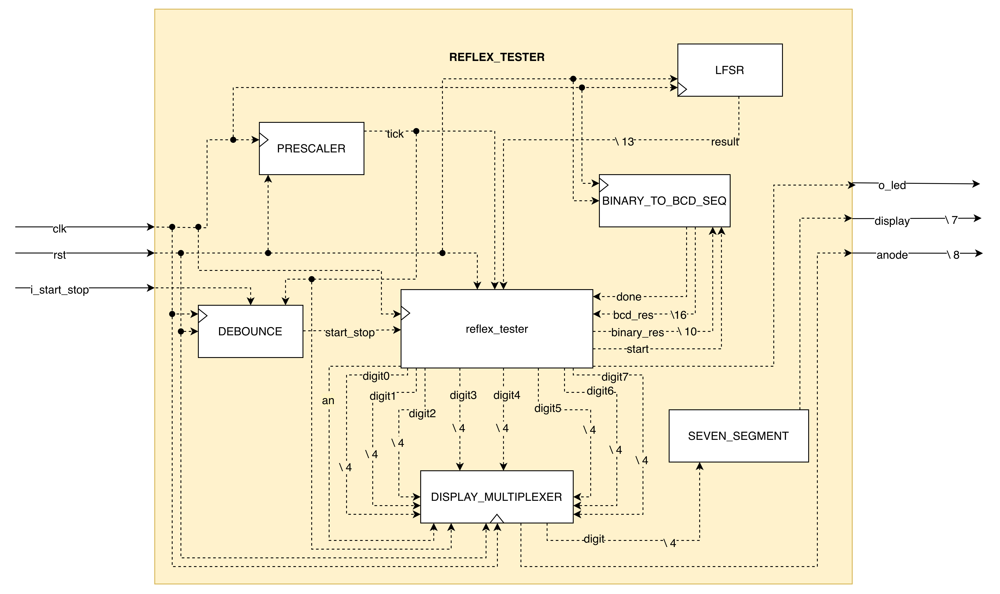
<figcaption>Schematic description of the components making up this
module and the signals interconnecting them</figcaption>
</figure>

The third implementation is a direct evolution of the first two,
incorporating the lessons learned from comparing them. Rather than
simply measuring a single reaction time, this implementation performs
five consecutive measurements and computes their average. Since the two
random delay generation methods were shown to produce identical logic
occupation, the LFSR is preferred for its better statistical properties,
ensuring a more uniform distribution of the random delays across the
five rounds. For the reaction time measurement, a binary counter is used
instead of the BCD cascade. This choice is motivated by the need to
perform arithmetic operations on the results: computing the sum of five
measurements and dividing by five is straightforward with binary-coded
values, while the same operations on BCD-coded values would require
significantly more complex logic. The conversion to BCD is handled by
the same binary_to_bcd_seq module introduced before. From a logic
occupation standpoint, this implementation behaves similarly to the
first one, since it shares the same counter and conversion approach. The
main architectural difference lies in the finite state machine, which
requires additional states to manage the sequence of five measurements,
the accumulation of results, and the final division. This adds a modest
number of Flip-Flops to encode the new states, but does not
significantly increase the combinatorial logic. In this case, the worst
Data Path Delay is when the average value is computed, since division is
heavy on the hardware.

<figure id="fig:placeholder" data-latex-placement="H">
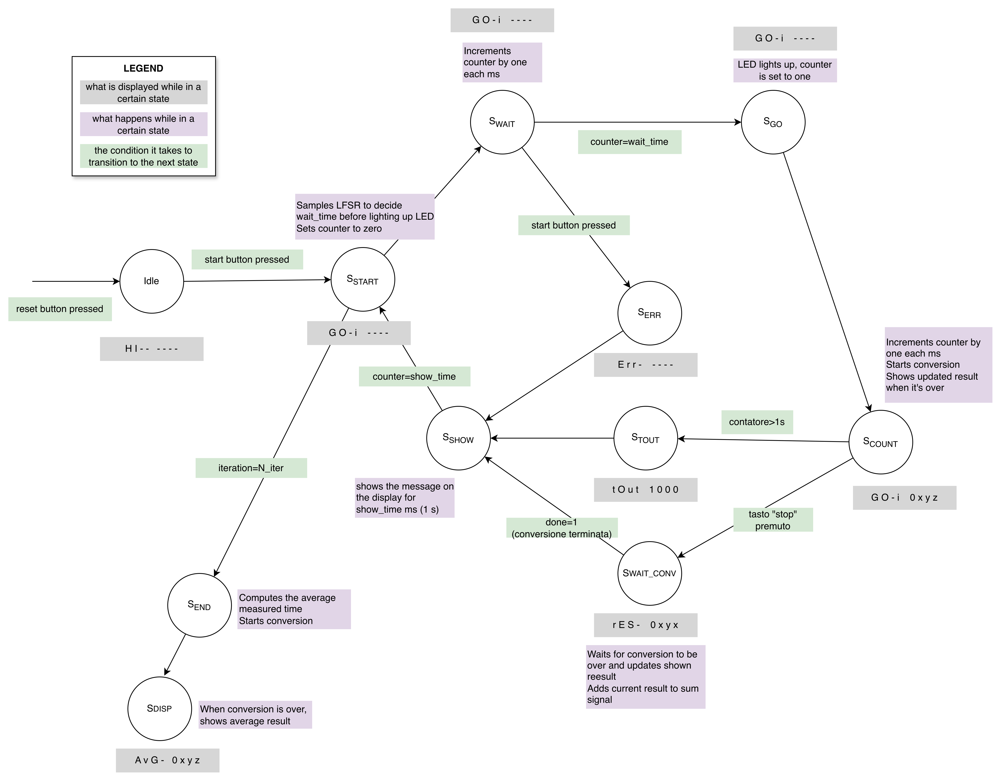
<figcaption>Finite state machine describing the module’s
behavior</figcaption>
</figure>

## Additional Alternative Implementations

### Combinatorial binary to BCD conversion

The current version of binary_to_bcd converter is a sequential one,
meaning one step of the algorithms is performed at each clock cycle,
reusing the same hardware. A possible alternative would be a
combinatorial conversion: the result is computed in a single clock
cycle, each iteration of the algorithm's loop becomes a separate stage
of logic. Since all 10 stages exist simultaneously as physical hardware,
the result is available after a single propagation delay through the
entire chain. The downside is that all 10 stages occupy logic at the
same time. The synthesizer instantiates all the comparators, adders and
wiring needed for every stage simultaneously, which is why the
combinatorial version would use significantly more LUTs than the
sequential one.

### Multiple tests using BCD counter

To avoid using a binary to bcd converter in the third implementation, a
possible approach would be using a BCD counter; this approach would
require the development of specific modules to manage BCD addition and
BCD division. Implementing the algorithms necessary to perform these
operations would require a lot of work and would add considerable
complexity to the module.

## Appendix: Components

### Inputs and Output signals

<figure id="fig:placeholder" data-latex-placement="H">
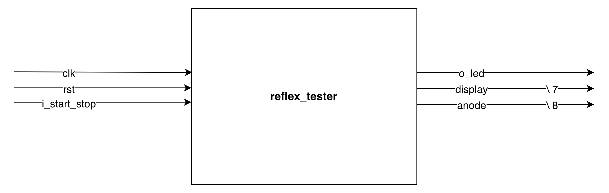
<figcaption>Module interface</figcaption>
</figure>

Each implementation has the following inputs and outputs:

- clk : board's characteristic clock signal, at a frequency of 100 MHz

- rst : input from the reset button, equal to 1 when pressed

- i_start_stop : input from the button pressed to start and stop the
  measurement, equal to 1 when pressed

- o_led : output signal that controls the LED, equal to 1 when it's on

- display : output signal , each od its bits controls a single segment
  in all digits (active low)

- an : output signal, each of its bits controls the activation of a
  single display digit (active low)

### Seven_segment

This component takes a 4-bit input and returns a 7-bit output encoding
necessary to represent the character on the seven-segment display. The
values from 0 to 9 represent numerical digits, while the subsequent
numbers from 10 to 15 are used to indicate the intent to display a
specific letter.

<figure id="fig:placeholder" data-latex-placement="H">
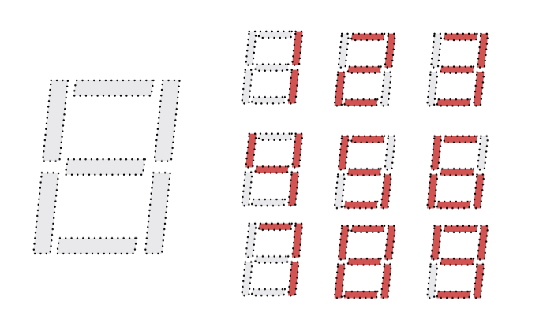
<figcaption>Seven segment display showing digits from 1 to
9</figcaption>
</figure>

### Prescaler

Since measurements are performed in ms, this component is responsible
for converting the board's clock signal into a signal that goes high
once every ms, and remains low the rest of the time. To achieve this, it
utilizes a counter that, upon reset activation, starts from zero and
increments by one at each clock cycle until it reaches f_clk/1000.

<figure id="fig:placeholder" data-latex-placement="H">
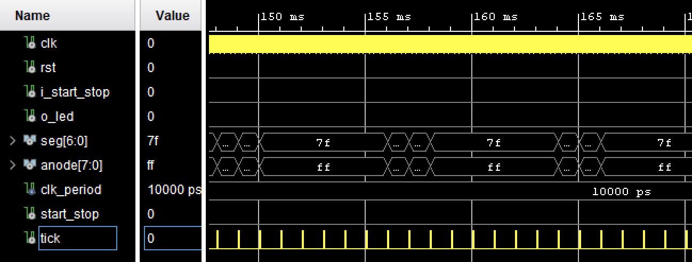
<figcaption>Results from the testbench: the tick signal only goes up
once every millisecond</figcaption>
</figure>

### Debouncer

This component is responsible for resolving a physical issue inherent to
mechanical buttons: when a button is pressed or released, the metallic
contacts do not open or close cleanly, but instead \"bounce\" multiple
times within a few milliseconds before stabilizing. The debouncer
detects the first time the input goes up and makes an internal signal,
start_done, go high for one clock cycle. Subsequent mechanical
oscillations of i_start_stop are then ignored for 100 ms.

<figure id="fig:placeholder" data-latex-placement="H">
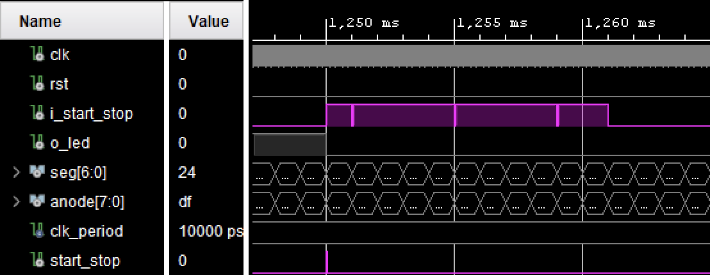
<figcaption>Results from the testbench: the i_start_stop signal goes up
and down a couple times in around 10 ms, but the start signal is high
only for one clock cycle</figcaption>
</figure>

### Display_multiplexer

This component is necessary since only one digit of the display at a
time can be active. Once every ms, one digit of the display is lit up.
As soon as its millisecond is up, the next digit will appear on the
display for one millisecond. Since the refresh rate is high, the human
eye doesn't notice the digits are off for most of the time. This
component relays the correct digit and anode configuration to the
display.

<figure id="fig:placeholder" data-latex-placement="H">
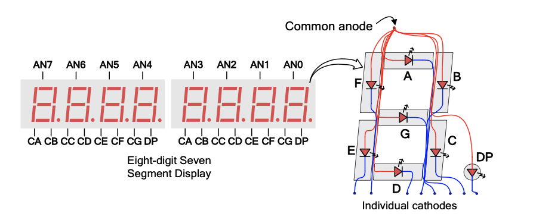
<figcaption>Signals that control the seven-segment display</figcaption>
</figure>

### LFSR

An LFSR (Linear Feedback Shift Register) is a shift register in which
the input bit at each clock cycle is computed as the XOR of specific
bits already present in the register. An $n$-bit LFSR cycles through all
its possible states before repeating, ensuring a uniform distribution of
values. In this case a 12-bit register is utilized, capable of
representing values from 0 to 4095. The output is obtained by adding
1000 to the register's current value. The result will always fall within
the range of 1000 to 5095 ms (approximately 1 to 5 seconds).

### Random_gen

The module uses a 12-bit binary counter stored in a register, which
increments by one at every clock cycle. The output value of random_gen
is determined by taking the value stored in the register at the sampling
instant and adding 1000 to it. Just like with the LFSR, this ensures the
output value falls approximately between 1 to 5 seconds. Because the
counter runs at a high frequency of 100 MHz and human reaction time when
pressing the button is inherently unpredictable, the sampled value
effectively basically behaves as a random number from the user's
perspective.

### Binary_to_bcd_seq

This module is responsible for converting a binary-coded input into a
BCD-coded output. Specifically, the conversion is carried out through
the sequential application of the Double Dabble algorithm. For each
conversion of an $n$-bit input, it is necessary to execute $n$ steps of
the algorithm; each step of the algorithm occupies one clock cycle. In
this case, the conversion requires 10 clock cycles to be completed. To
trigger the conversion, a high start signal must be sent to the module;
once the iterations have been performed, the module asserts a done
signal.

## Test Benches

To verify the correct behaviour of the developed modules, simulations
are carried out using VHDL testbenches. Each testbench instantiates the
component under test as a DUT (Device Under Test) and drives its inputs
with predefined sequences, covering both normal operation and edge
cases. Results are then analysed using the Vivado waveform viewer. You
will be given two testbenches; below is a description of their behavior.

### Testbench for the first and second implementation

This testbench verifies the behaviour of the whole reflex_tester system
for the first two implementations. The clock is generated with a period
of 10 ns, corresponding to a frequency of 100 MHz. To make the
simulation more realistic, the i_start_stop and reset signal are made to
bounce multiple times, simulating the mechanical bouncing of a physical
button. The four scenarios verified in sequence are:

1.  **Normal measurement**: after pressing the start button, the system
    waits for the LED to turn on, then a reaction time of 234 ms is
    simulated before the stop button is pressed. The expected behavior
    is the display of the result.

2.  **Timeout**: after the LED turns on, the player does not press the
    button within the 1000 ms limit. The expected behavior is a
    transition to the stout state with the timeout message shown on the
    display.

3.  **False start**: the stop button is pressed during the waiting
    phase, before the LED turns on. The expected behavior is a
    transition to the serr state with the error message shown on the
    display.

4.  **Recovery after error**: following the false start, the system is
    expected to return to the initial state and complete a new normal
    measurement with a reaction time of 234 ms.

### Testbench for the third implementation

This testbench verifies the behaviour of the whole reflex_tester system
for the first third implementation; as in the previous testbench, all
inputs are applied with simulated mechanical bouncing. The sequence of
scenarios is more articulated and comprises :

1.  **Normal measurement (iteration 1)**: a reaction time of 200 ms is
    simulated. The expected behaviour is the display of the result.

2.  **Timeout (iteration 2)**: the player does not press the button
    within 1001 ms of the LED turning on. The expected behaviour is a
    transition to the stout state.

3.  **Normal measurement (iteration 2)**: after the timeout, the system
    is expected to recover correctly and complete a new measurement with
    a reaction time of 300 ms.

4.  **False start (iteration 3)**: the button is pressed before the LED
    turns on. The expected behaviour is a transition to the serr state
    with the error message on the display.

5.  **Normal measurement (iteration 3)**: the system is expected to
    recover correctly and complete a new measurement with a reaction
    time of 300 ms.

6.  **Normal measurement (iteration 4)**: a further measurement is
    performed with a reaction time of 250 ms.

7.  **Normal measurement (iteration 5)**: a further measurement is
    performed with a reaction time of 200 ms.

At the end of the five measurements, the expected average output value
is 250 ms.
